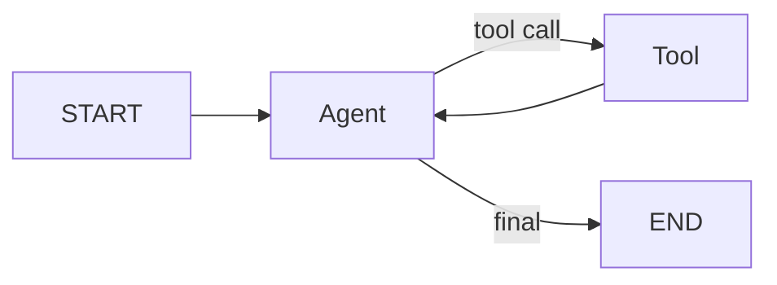

# LangGraph Guide

LangGraph is useful when an agent needs explicit state, nodes, conditional
edges, persistence, streaming, or human checkpoints. Current LangGraph Python
docs show two main styles: the `StateGraph` graph API and the functional API.



## Minimal Shape

```python
from langgraph.graph import StateGraph, START, END
from typing_extensions import TypedDict

class State(TypedDict):
    messages: list

builder = StateGraph(State)
builder.add_node("agent", call_model)
builder.add_edge(START, "agent")
builder.add_edge("agent", END)
graph = builder.compile()
```

## Design Tips

- Put durable information in state, not hidden globals.
- Keep node functions small and deterministic where possible.
- Use conditional edges for routing decisions.
- Add persistence/checkpointing for long-running or human-reviewed flows.
- Treat tools as side-effect boundaries and log their inputs and outputs.

## When to Use It

Use LangGraph for multi-step workflows, agents that call tools repeatedly,
approval flows, and graph-shaped control logic. For one model call with one
response, a direct model API is usually simpler.
