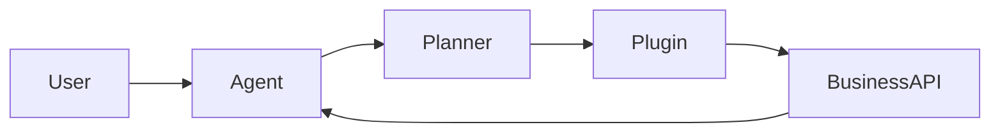

# Microsoft Agent Framework Guide

Microsoft's agent ecosystem is centered on Azure AI services, Copilot
extensions, AutoGen, and Semantic Kernel. For Python developers, Semantic Kernel
is the most practical public reference point for plugin-oriented agents:
business functions are exposed as callable plugins, and the agent runtime routes
model requests to those functions.



## Core Ideas

- **Agent:** Holds instructions, model configuration, and available plugins.
- **Plugin:** A grouped set of callable business functions.
- **Function calling:** The model chooses a plugin function with structured
  arguments.
- **Planner/orchestrator:** Coordinates multi-step calls when one function is
  not enough.
- **Connectors:** Bind the runtime to Azure OpenAI, OpenAI, local models, or
  enterprise APIs.

## Example Plugin Shape

```python
class DocsPlugin:
    def summarize(self, text: str) -> str:
        return text[:200]
```

## Production Guidance

- Keep plugin functions small and idempotent.
- Validate inputs before calling internal systems.
- Log tool calls, latency, and model-chosen arguments.
- Add human approval around write operations.
- Use Azure identity and managed secrets rather than hard-coded keys.

The local example in `../examples/ms_agent_example.py` demonstrates the plugin
shape without requiring Azure credentials.
