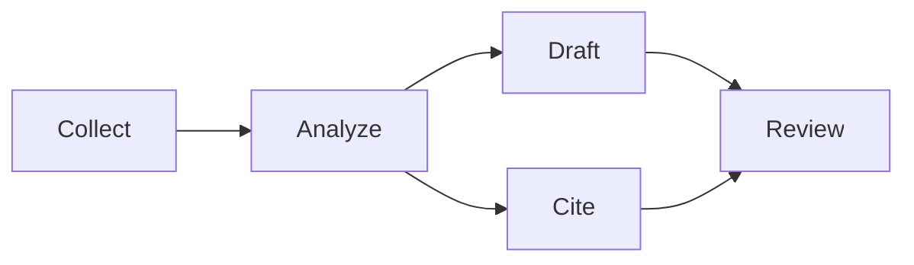
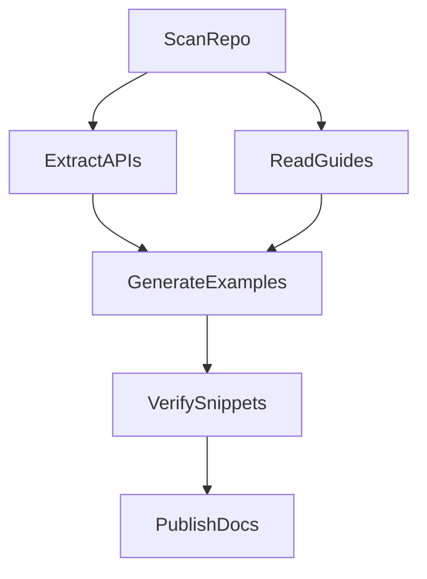

# DAG Concepts for AI Agent Systems

A directed acyclic graph, or DAG, is a workflow where edges point from earlier
work to later work and cycles are forbidden. DAGs are useful for agent systems
because they make dependencies explicit.



## Why DAGs Help Agents

- They reveal which tasks can run in parallel.
- They prevent hidden dependency loops.
- They create stable checkpoints for retries.
- They make observability easier because every node has inputs and outputs.

## Topological Sorting

Topological sort returns an order where every dependency appears before the node
that needs it. If no such order exists, the graph has a cycle and should not run.

```python
dag.add_edge("collect", "rank")
dag.add_edge("rank", "summarize")
order = dag.topological_sort()  # ["collect", "rank", "summarize"]
```

## DAGs and Loops

DAGs and loops solve different problems:

| Pattern | Best For |
| --- | --- |
| DAG | Known dependency structure |
| Retry loop | Uncertain success of one step |
| Plan-execute-verify | Sequential work with validation |
| Conditional DAG | Branching decisions |

In production, each DAG node often contains a loop. For example, a `write_code`
node may retry until tests pass, while the overall DAG still ensures review
happens only after implementation.

## Validation Rules

Before executing a workflow:

1. Every referenced node exists.
2. The graph has no cycles.
3. Inputs required by each node are produced upstream.
4. Failure policy is clear: retry, skip, compensate, or stop.
5. Outputs are serializable enough for logs and checkpoints.

## Real-World Scenario

A documentation agent might run:



The examples in `../examples` implement a basic executor, a conditional DAG,
and a DAG whose nodes use retry loops.
