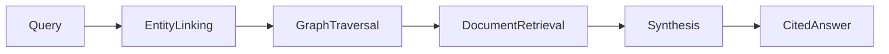
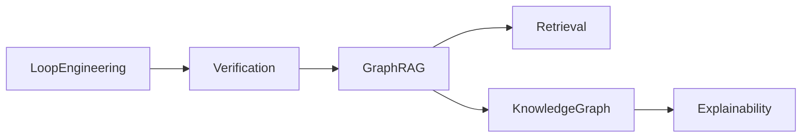

# Graph RAG Guide

Graph RAG combines retrieval-augmented generation with a knowledge graph. Instead
of retrieving only chunks by semantic similarity, the system also follows
relationships between entities.



## Core Components

| Component | Responsibility |
| --- | --- |
| Chunk store | Holds source passages and document metadata |
| Entity extractor | Finds people, systems, APIs, concepts, and files |
| Graph store | Records nodes and relationships |
| Retriever | Combines text similarity with graph expansion |
| Synthesizer | Writes an answer grounded in retrieved evidence |
| Evaluator | Checks citation coverage and answer faithfulness |

## Retrieval Pattern

1. Extract query entities.
2. Find matching graph nodes.
3. Traverse one or two hops to related concepts.
4. Collect documents attached to those nodes.
5. Rank by text relevance plus graph proximity.
6. Generate an answer with citations.

```python
docs = graph.retrieve("How does Graph RAG improve explainability?", depth=1)
answer = graph.answer("How does Graph RAG improve explainability?")
```

## When Graph RAG Beats Plain RAG

- The domain has important relationships: dependencies, ownership, lineage, or
  legal entities.
- Queries require multi-hop reasoning.
- Users need explanations for why a source was retrieved.
- The corpus changes over time and needs incremental updates.

## Implementation Tips

- Keep source document IDs on every node relationship.
- Store relationship confidence and extraction method.
- Prefer shallow traversal first; multi-hop expansion can add noise quickly.
- Evaluate both retrieval quality and final answer faithfulness.
- Include graph snapshots in debugging output.

## Example Graph



The examples in `../examples` show a small in-memory implementation, a reusable
knowledge graph builder, and a verification loop that repairs missing evidence.
