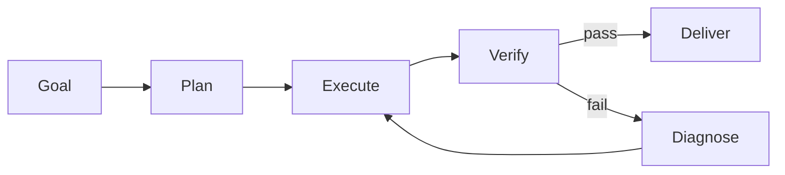
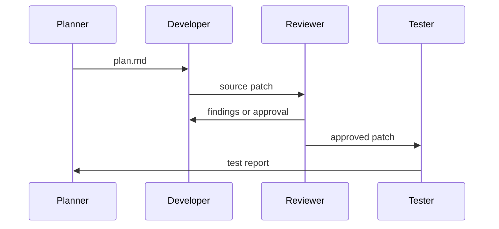

# Loop Engineering Best Practices

Loop engineering turns one-shot prompting into a controlled cycle: act, inspect,
repair, and repeat until a verifier says the result is good enough. The core
skill is not writing longer prompts. It is designing the feedback loop.



## Production Loop Checklist

| Concern | Practice | Failure Mode Prevented |
| --- | --- | --- |
| Goal | Store the requested outcome in structured state | Agent optimizes for the wrong target |
| Attempts | Record inputs, outputs, errors, and verifier results | Repeated blind retries |
| Verification | Use executable checks before human review | Plausible but broken artifacts |
| Budget | Cap attempts, time, tokens, and tool calls | Runaway automation |
| Recovery | Feed diagnostic facts into the next attempt | Same fix tried repeatedly |
| Isolation | Use temp dirs, worktrees, or sandboxes for risky work | User changes overwritten |
| Observability | Emit logs and final reports | Impossible postmortems |

## Retry Loops

Use retry loops for unstable operations: API calls, flaky tests, generated code,
or any task where the next attempt can use concrete feedback.

```python
loop = RetryLoop(max_attempts=3, delay_seconds=0.25)
result, context = loop.run(
    lambda ctx: call_model(ctx.memory.get("last_exception")),
    verify=lambda text: "PASS" in text,
)
```

Good retry loops distinguish between transient errors and bad results. A network
timeout may need backoff; a failing test needs the assertion output in memory.

## Plan-Execute-Verify Loops

For multi-step work, make each step independently verifiable:

1. Plan the next small action.
2. Execute only that action.
3. Verify the expected state changed.
4. Stop immediately if verification fails.

This keeps errors near their cause. It also gives humans a clear audit trail.

## Multi-Agent Loops

Multi-agent systems work best when agents have bounded roles and shared state:



Avoid vague "collaboration" agents. Prefer named responsibilities such as
planner, implementer, reviewer, tester, release writer, or incident commander.

## Verifier Design

Strong verifiers are specific, cheap, deterministic, and hard to satisfy by
accident. Examples:

- Unit tests for generated code.
- JSON Schema validation for structured output.
- Static scans for forbidden APIs or secrets.
- Golden-file comparisons for deterministic transformations.
- Human approval for business or legal judgment.

Weak verifiers are broad language checks such as "does this look good?" Use
them only as a final review layer.

## Circuit Breakers

Stop early when repeated attempts cannot make progress:

- Open the circuit after N consecutive tool failures.
- Stop on the same verifier error repeated without state changes.
- Escalate to a human when credentials, permissions, or missing context block
  progress.

## Practical Scenario

A code-fixing loop can work like this:

1. Run a failing test and capture the assertion.
2. Ask an implementation agent for the smallest patch.
3. Apply the patch in a worktree.
4. Run the same test.
5. If it fails, attach the new traceback to retry memory.
6. If it passes, run the relevant suite and request review.

The examples in this directory implement these patterns in Python and
TypeScript without external services.
