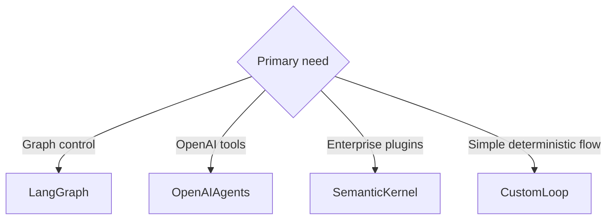

# AI Agent Frameworks Comparison

No single framework wins every agent project. Choose based on control flow,
state, deployment, observability, and the team’s preferred ecosystem.

| Framework | Best Fit | Strengths | Watchouts |
| --- | --- | --- | --- |
| OpenAI Agents SDK | Python apps using OpenAI models and tools | Small primitive set, tracing, handoffs, guardrails, sessions | Live runs require API credentials |
| LangGraph | Stateful graph workflows | Explicit nodes, edges, persistence, streaming, human checkpoints | More structure than simple apps need |
| Semantic Kernel / Microsoft ecosystem | Enterprise plugin integration | Plugins, Azure integration, .NET/Python/Java support | Product surface changes across Azure/Copilot services |
| Custom loop | Deterministic internal automation | Full control, easy tests | You own orchestration and observability |

## Selection Questions

1. Does the workflow need explicit branching or persistence?
2. Are tools simple functions or enterprise APIs with governance?
3. Do you need human-in-the-loop checkpoints?
4. Will CI run without model credentials?
5. How will traces and failures be reviewed?

## Recommendation

Start with the smallest framework that gives you the missing control plane. If a
plain loop and tests are enough, use them. Move to LangGraph when stateful graph
control matters. Use the OpenAI Agents SDK when you want a managed agent loop
around OpenAI models, tools, guardrails, and handoffs. Use Microsoft’s ecosystem
when your agent is primarily an enterprise plugin or Azure integration surface.
