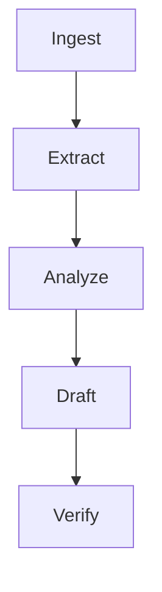

# DAG Workflows Guide

DAG workflows make dependencies explicit. For AI agents, this prevents a common
failure mode: a model starts writing final output before upstream evidence,
tests, or review exist.



## Build the First DAG

```python
dag = DAG()
dag.add_node("collect", lambda ctx: ["a", "b"])
dag.add_node("summarize", lambda ctx: len(ctx["results"]["collect"]))
dag.add_edge("collect", "summarize")
results = DAGExecutor(dag).run()
```

## Add Branching

Conditional DAGs route based on state:

```python
workflow = build_code_change_workflow(change_needed=False)
assert workflow.run({})["visited"] == ["inspect", "skip"]
```

## Combine DAGs and Loops

Use DAGs for order and loops for resilience. A `write_code` node can retry until
tests pass while the larger DAG still controls when review and docs happen.

## Exercise

Add a `security_review` node after `test` in `dag-workflows/examples/advanced_dag.py`.
Update the branch test to expect it before `document`.
