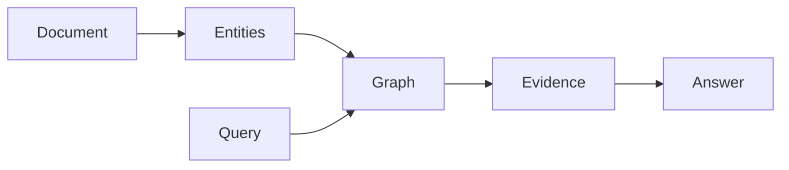

# Graph RAG Tutorial: Building Knowledge Graphs for AI

Graph RAG improves plain retrieval by adding relationships. Instead of asking
"which chunks are similar?", it also asks "which entities are connected?"



## Step 1: Add Documents

```python
graph = GraphRAG()
graph.add_document("doc1", "Graph RAG uses entity traversal.", ["Graph RAG", "entity traversal"])
```

## Step 2: Retrieve by Query

```python
docs = graph.retrieve("How does entity traversal help retrieval?")
```

The retriever scores both token overlap and graph proximity.

## Step 3: Generate Cited Answers

```python
answer = graph.answer("How does Graph RAG use a knowledge graph?")
```

Keep citations in the answer so users can inspect the source path.

## Exercise

Add a document about "hybrid search" to `graph-rag/examples/basic_graph_rag.py`
and query for both vector retrieval and graph traversal.
