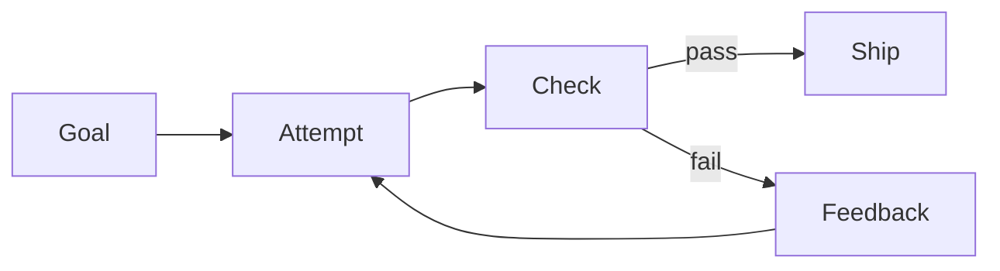

# Loop Engineering 101

Loop engineering is the practice of wrapping AI calls in a controlled system:
plan, act, verify, and retry with feedback. It is the next step after prompt
engineering because it treats model output as one part of a larger workflow.



## From Prompts to Loops

A prompt asks for an answer. A loop asks for a result and keeps checking until a
verifier accepts it. This matters for code generation, document analysis, RAG,
data extraction, and any task where correctness is measurable.

## First Loop

Run the Python retry example:

```bash
python3 loop-engineering/examples/python/retry_loop.py
```

It first emits broken code, uses the verifier failure as memory, then retries
with a corrected implementation.

## Common Loop Types

| Loop | Use Case |
| --- | --- |
| Retry | Flaky calls, generated code repair |
| Plan-execute-verify | Multi-step tasks with checkpoints |
| Review loop | Human or model critique before delivery |
| Multi-agent | Specialized roles coordinated by shared state |

## Exercise

Modify `bug_fixing_demo()` so the first attempt raises an exception instead of
returning bad code. Confirm the retry context records `last_exception`.
