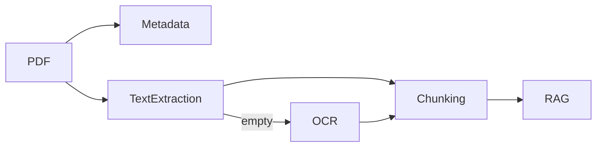

# PDF Processing Guide for AI Systems

PDFs are containers for objects, streams, fonts, images, and metadata. AI
systems should inspect the file before assuming it contains extractable text.

## Processing Pipeline



## Tool Choices

| Need | Tooling |
| --- | --- |
| Raw triage | Header, object, stream scans |
| Text extraction | pypdf, pdfminer.six, PyMuPDF |
| OCR | Tesseract, cloud OCR, vision models |
| Repair | qpdf, Ghostscript |
| Forensics | hashes, metadata, JavaScript markers |

## Try the Local Examples

```bash
python3 pdf-processing/examples/pdf_metadata.py sample.pdf
python3 pdf-processing/examples/pdf_extractor.py sample.pdf
```

The examples are intentionally small and inspectable. Use mature parsers for
production ingestion.

## Exercise

Extend `pdf_metadata.py` to count `%%EOF` markers and flag incremental updates.
